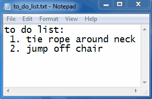

# Windows-Hacks
Creative and unusual things that can be done with the Windows API.

## Shrinking Windows
Any window can be shrunk down (this is quite useful if you are an ant).

Shrinking the Calculator:

![alt-tag] (gifs/shrinking_calculator.gif)

Shrinking Google Chrome:

![alt-tag] (gifs/shrinking_google_chrome.gif)

Even Microsoft Word is not safe from being shrunk:

![alt-tag] (gifs/shrinking_microsoft_word.gif)

## Writing Directly To The Desktop

![alt-tag] (gifs/writing_to_desktop.gif)

## Hue Shifter

Any window can be selected to have its colors shifted. 

Hue shifting Microsoft Paint:

![alt-tag] (gifs/hue_shifting_microsoft_paint.gif)

Hue shifting Microsoft Word:

## Desktop Rotation

![alt-tag] (gifs/rotating_desktop.gif)

## Window Shaker

Randomly shakes the specified Window without the use of a mouse.

Here you can see Microsoft Paint shaking all by itself. Pretty spooky huh?

## Wavy Window

## Scrambling a Window

## Window Thresholding/Tracing

This makes the light colors transparent and the dark colors black.

Before thresholding:

![alt-tag] (gifs/thresholding_before.png)

After thresholding:

![alt-tag] (gifs/thresholding_after.png)

## Force Changing Window Properties

Many of the properties of a Window can be force changed. In the image below I have changed the following properties in the Windows Calculator:
 - Disabled the close, maximimize and minimize buttons
 - Removed the drop down menu (View, Edit, Help)
 - Changed the width and height of the Window borders
 - Changed the title
 

 
## Mouse Spam

Each mouse moves independently across the screen.

## Hiding a Window

Any Window can be hidden. In the following image I have hidden the Windows Calculator. As you can see, it is no where to be found on the Desktop. But if you open the Windows Task Manager it is actually still running in the background:

## More...

Here is the menu. It lists all of the features:

## Notes

The External folder contains two essential .dll files that must be referenced for the code to work. These two files are WindowsAPI.dll and and ImageProcessing.dll and the code for these can be seen in my Task-Automation and Image-Processing-Library repositories respectively. 

This has only been tested on Windows 7.
